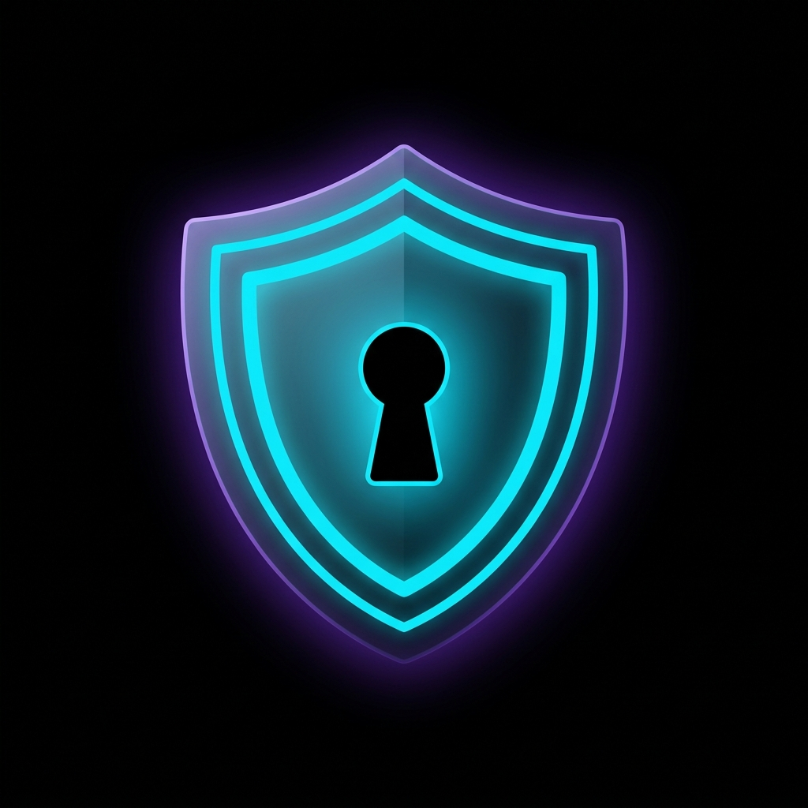
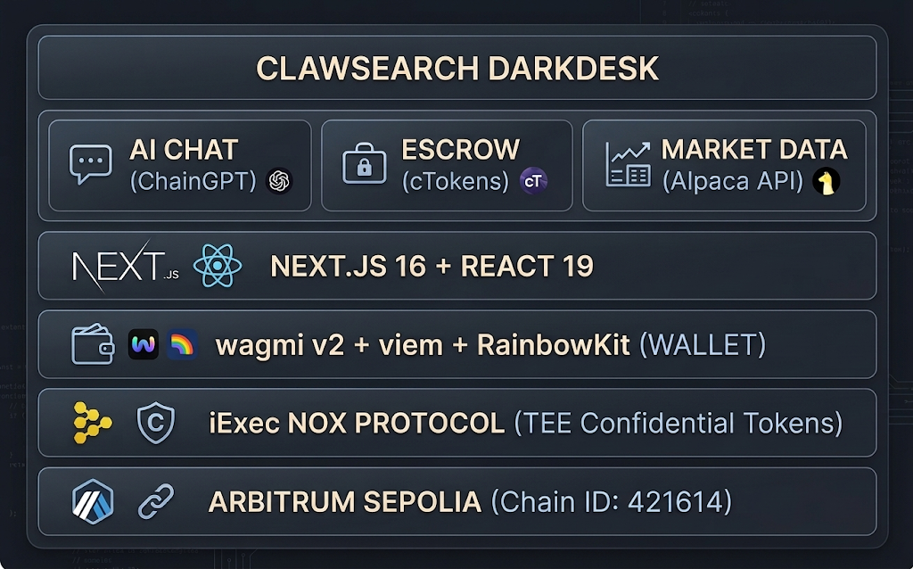

<div align="center">
  
  <h1>ClawSearch DarkDesk 🛡️</h1>
  <p><em>AI-Brokered OTC Dark Pool for Confidential RWA Trading.</em></p>
  
  [](https://clawsearch-darkdesk.vercel.app)
  [](#)
  [](https://docs.iex.ec/)
  [](https://chaingpt.org/)
  [](https://sepolia.arbiscan.io/)
</div>

---

## 📸 See it in Action
*(Insert a high-quality GIF here showing the core workflow of your app)*


## 💡 The Problem & Solution

In today's world, when institutional players trade large blocks of tokenized Real World Assets (RWAs) — such as $5M of tokenized T-Bills — public blockchains broadcast every detail. MEV bots front-run, copy-traders pile on, and slippage costs 2–5% of trade value. In traditional finance, dark pools solve this. On-chain, there is no privacy layer for confidential OTC settlement.
**Result**: The $15T RWA tokenization wave stays stuck because institutions can't trade without broadcasting their intent.

**ClawSearch DarkDesk** solves this by acting as an AI-brokered OTC dark pool built on iExec Confidential Tokens and the Nox Protocol.

**Key Features:**
- 🤖 **AI Trade Negotiator:** ChainGPT Web3 LLM-powered chat for natural-language OTC negotiation.
- 📈 **Live RWA Price Oracle:** Alpaca API for real-time T-Bill yields and stock prices — zero mocked data.
- 🔒 **Confidential Wrap/Unwrap:** ERC-20 ↔ cToken conversion via iExec Nox Protocol.
- 🤝 **Confidential Escrow:** Atomic swap contract holding both parties' cTokens.
- 🔍 **Split-Screen Verifier:** Side-by-side: Arbiscan (encrypted) vs. DarkDesk (real balances).

## 🏗️ Architecture & Tech Stack

We built the frontend using **Next.js 16** and **Tailwind CSS v4**. The Web3 integration uses **wagmi v2** and **viem** connected to **Arbitrum Sepolia**. We integrated the **ChainGPT API** to power the AI negotiator and the **Alpaca Markets API** for live off-chain oracle data. Our smart contracts are built with **Solidity** using the **iExec Nox Protocol** for TEE Confidential Tokens.



## 🏆 Sponsor Tracks Targeted

* **[iExec]**: We used the Nox Protocol (TEE Confidential Tokens) to hide OTC settlement amounts and balances. The confidential wrapper implementation can be found in `contracts/DarkDeskEscrow.sol`.
* **[ChainGPT]**: We used the ChainGPT Web3 LLM API to build the AI Negotiator that brokers the trade. The implementation can be found in `src/lib/chaingpt.ts` and `src/app/api/chat/route.ts`.

## 🚀 Run it Locally (For Judges)

1. **Clone the repo:** `git clone https://github.com/edycutjong/clawsearch-darkdesk.git`
2. **Install dependencies:** `cd clawsearch-darkdesk && npm install`
3. **Set up environment variables:** Rename `.env.example` to `.env.local` and add your keys (see table below).
4. **Run the app:** `npm run dev`

> **Note for Judges:** 
> Our front-end runs on `http://localhost:3000`. You will need to connect a wallet via RainbowKit. Please ensure you are connected to the **Arbitrum Sepolia (Chain ID: 421614)** testnet and have Testnet ETH to cover gas for the Escrow.

### Environment Variables

| Variable | Source |
|---|---|
| `CHAINGPT_API_KEY` | Contact @vladnazarxyz on Telegram |
| `ALPACA_API_KEY` / `ALPACA_API_SECRET` | [Alpaca Markets](https://app.alpaca.markets/) (free paper trading) |
| `NEXT_PUBLIC_WALLETCONNECT_PROJECT_ID` | [WalletConnect Cloud](https://cloud.walletconnect.com/) |
| `NEXT_PUBLIC_ESCROW_CONTRACT_ADDRESS` | After deploying `DarkDeskEscrow.sol` to Sepolia |

---

## 📁 Project Structure

```text
🏆 clawsearch-darkdesk/
│
├── 📂 contracts/             # Solidity Smart Contracts (iExec Nox Escrow)
├── 📂 docs/                  # Architecture diagrams and pitch assets
├── 📂 public/                # Logos and app demonstration GIFs
├── 📂 src/
│   ├── 📂 app/               # Next.js 16 App Router (Pages & API Routes)
│   ├── 📂 components/        # React 19 UI Components (Dark Pool features)
│   └── 📂 lib/               # App Logic (ChainGPT & Alpaca Clients)
│
├── 📄 .env.example           # Secure template for judges to configure API keys
├── 📄 feedback.md            # Required iExec developer feedback
├── 📄 README.md              # Project Pitch & Documentation
└── 📄 package.json           
```

---

## 📄 License & Credits

MIT © 2026 [Edy Cu](https://github.com/edycutjong)

**Built for [iExec Vibe Coding Challenge](https://dorahacks.io/hackathon/vibe-coding-iexec)**

By: [@edycutjong](https://x.com/edycutjong) | Tags: @iEx_ec @Chain_GPT
